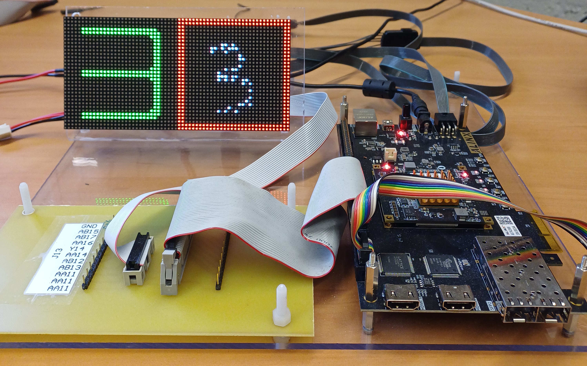

# SRC - SNN - 01

  

A Julia-based toolchain and a VHDL code suite for implementing **spiking neural network (SNN)** based on **Spiking Recurrent Cell (SRC)** neurons. The neural network is evaluated using the **MNIST** and **FashionMNIST** datasets.

This repository is primarily a *working research repo*: it contains Julia notebooks (data + model preparation) and VHDL packages/entities (FPGA-oriented implementation + simulation).

---

## Fashion-MNIST & MNIST Dataset and 

- **Input:** FashionMNIST & MNIST classification using spike trains (rate encoding)-28×28 pixels ⇒ **784 input spikes per timestep**.
- **Network** (VHDL implementation):
        - FashionMNIST : **784 → 100  → 100  → 100  → 100 → 10** (hidden layer = 100 neurons, output = 10 classes).
        - MNIST : **784 → 100 → 10** (hidden layer = 100 neurons, output = 10 classes).
- **Output:** interger value between 0 and 9.

---

## Repository layout (top level)

| Path | What it is |
|---|---|
| `.gitattributes` | Git attribute settings (line-ending normalisation). |
| `README.md` | This file. |
| `01 - Julia/` | Julia notebooks and tooling (dataset generation, model simulation, VHDL code export). |
| `02 - FPGA/` | VHDL sources and COE files (FPGA implementation). |

---

## Julia side (dataset + modelling + export)

### Folders

| Path | What it is |
|---|---|
| `01 - Julia/01 - SRC-NFPGA 01/` | SRC neuron parameter sweeps and `Zhyp` calibration notebooks + exported plots. |
| `01 - Julia/02 - Mnist2NPY-GIF/` | MNIST → spike-train conversion and visualisation notebooks. |
| `01 - Julia/03 - SNN-SRC-Flo-PsV/` | Network simulation and floating vs FPGA-style comparison notebooks + model artefacts. |
| `01 - Julia/04 - Npy2COEXOR/` | Converters from NPY spike trains to FPGA `.coe` initialisation files. |
| `01 - Julia/05 - GenVhdlCode/` | VHDL package/code generation notebooks (weights/coefficients). |
| `01 - Julia/MNIST/` | Generated datasets (NPY/GIF/COE). |
| `01 - Julia/MyLib/` | Reusable Julia helper library. |

### Key files (what to open first)

---

## Practical notes

### Weight quantisation / scaling variants
`WeightMatrix01_pkg(+-XXX).vhd` are multiple generated variants of the **784→100** weight package.  
They correspond to different quantisation/scaling choices (useful for accuracy vs hardware cost trade-offs).

---

## Contact
Maintainer: Pascal Harmeling (ULiège) — pascal.harmeling@uliege.be.
